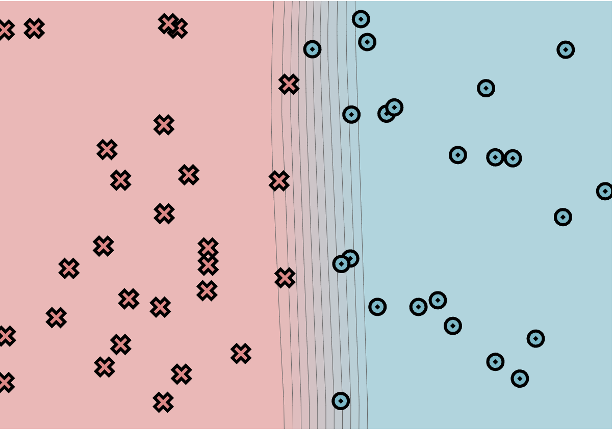
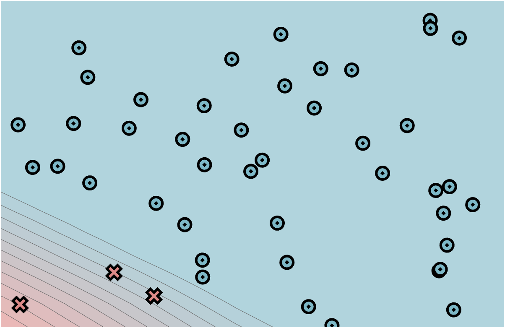
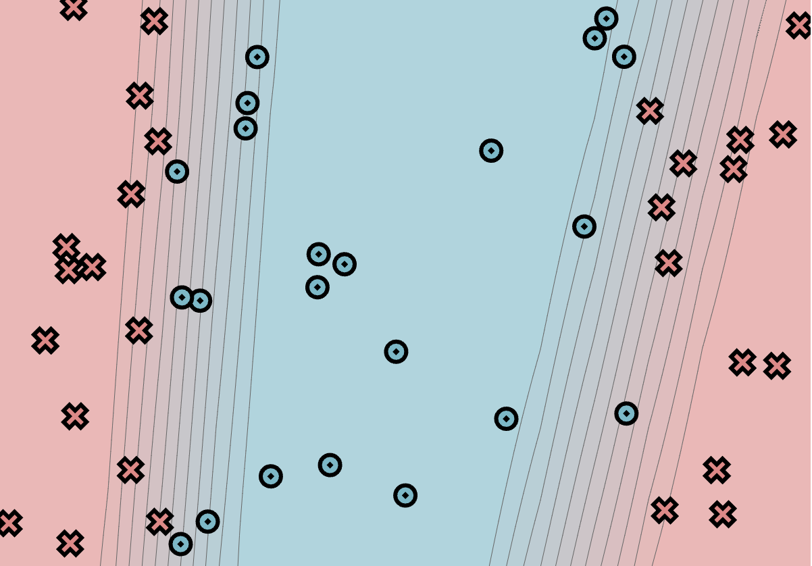
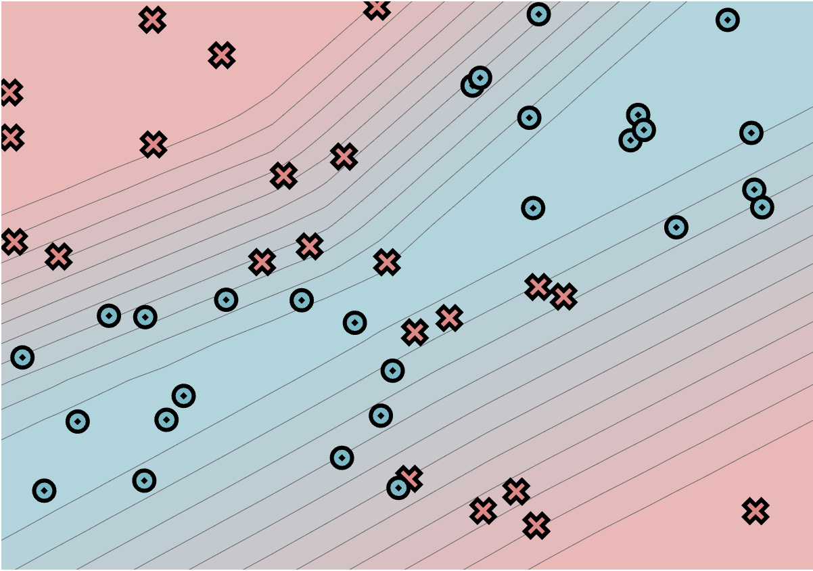

# minitorch

The full minitorch student suite.

Results of Scalar trainings:
Simple dataset - 1.8237653696407827

Diag dataset - 1.6438533724645044

Split dataset - 8.62996728737011

XOR dataset - 23.471452000901554

Results of Scalar trainings:
Simple dataset - 0.23788833287600702
Time is 12.71

Diag dataset - 1.0364295933251353
Time is 12.87

Split dataset - 20.5017117559040
Time - 12.75

XOR dataset - 29.420993854147564
Time - 12.71

To access the autograder:

* Module 0: https://classroom.github.com/a/qDYKZff9
* Module 1: https://classroom.github.com/a/6TiImUiy
* Module 2: https://classroom.github.com/a/0ZHJeTA0
* Module 3: https://classroom.github.com/a/U5CMJec1
* Module 4: https://classroom.github.com/a/04QA6HZK
* Quizzes: https://classroom.github.com/a/bGcGc12k
